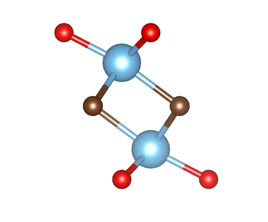

<p align="center">
  
</p>

# Gas Molecule Adsorption on MXene Ti₂CO₂ Monolayer: A Multi-Method DFT Bonding Analysis

A computational study of gas molecule adsorption (NH₃, CO₂, NO₂, H₂S) on Ti₂CO₂ MXene monolayer, using complementary **periodic DFT (Quantum ESPRESSO)** and **cluster model (ORCA + Multiwfn)** approaches to evaluate the potential of Ti₂CO₂ as a gas-sensing material.

## Motivation

Ti₂CO₂ MXene has drawn significant attention as a candidate gas-sensor material because its surface termination group (=O) is sensitive to small gas molecule adsorption, which manifests as changes in work function and local charge distribution. This project explores that interaction from two complementary perspectives:

- **Periodic DFT (QE)** — captures the electronic response of the material as a full slab (band structure, work function, surface-scale charge transfer)
- **Cluster model (ORCA + Multiwfn)** — captures the local bonding character at the adsorption site in finer detail (interaction type, bonding topology)

The periodic-DFT methodology in this project builds on prior thesis research on the Ti₂CO₂/MoS₂ heterostructure for aluminum-ion battery applications.

**All four gas molecules show favorable (exothermic) adsorption in both the periodic and cluster models, with a consistent adsorption-strength ordering across methods — supporting Ti₂CO₂'s potential as a gas-sensitive surface.**

## Research Questions

1. What is the adsorption character (physisorption vs. chemisorption) of each gas molecule on the Ti₂CO₂ surface?
2. How large is the work function change upon adsorption, and is it significant enough for sensing applications?
3. Is the charge-transfer trend from the periodic model (QE) consistent with the cluster model (ORCA/Multiwfn)?

## Methodology

### 1. Periodic DFT (Quantum ESPRESSO)
- Ti₂CO₂ monolayer slab with a vacuum layer, optimized prior to gas molecule adsorption
- Computational parameters (cutoff energy, k-points) determined via convergence testing on the pristine monolayer — see [`docs/methodology.md`](docs/methodology.md)
- Adsorption energy: E_ads = E_(slab+molecule) − E_slab − E_molecule
- Post-processing with `pp.x` and `projwfc.x`: charge density difference (Δρ), planar-averaged electrostatic potential (work function shift), projected density of states (PDOS)

### 2. Cluster Model (ORCA + Multiwfn)
- A finite cluster (Ti-Ti-C-O-O core) cut from the adsorption site, plus the adsorbed molecule
- Geometry optimization and single-point energy with PBE-D3(BJ)/def2-SVP (RIJCOSX, TightSCF)
- Multiple spin multiplicities tested for the bare cluster and for open-shell adsorbates (NO₂) to identify the correct ground state — see [`docs/methodology.md`](docs/methodology.md) for full discussion
- Multiwfn analysis: NCI (Non-Covalent Interaction) plots, ELF (Electron Localization Function), and two independent charge-partitioning schemes (ADCH, Bader/AIM)

### 3. Cross-Method Synthesis
Comparison of adsorption energetics, charge transfer, and bonding character between the two approaches to evaluate consistency and the limitations of each method.

## Gas Molecules Studied

| Molecule | Rationale |
|---|---|
| NH₃  | Common indoor/industrial air pollutant; tests sensitivity to a simple lone-pair electron donor |
| CO₂  | Ubiquitous, chemically stable, linear nonpolar molecule; tests sensitivity to a weakly-interacting closed-shell gas |
| NO₂  | Toxic combustion byproduct with open-shell (radical) character; tests sensitivity to a reactive, unpaired-electron species |
| H₂S  | Toxic, corrosive industrial/biological gas; tests sensitivity to a polarizable, sulfur-containing molecule |

## Key Results

### Adsorption Energy — Consistent Ordering Across Both Methods

| Molecule | E_ads QE (eV) | E_ads ORCA (eV) |
|---|---|---|
| NH₃ | −1.556 | −1.717 |
| CO₂ | −1.590 | −2.063 |
| NO₂ | −1.542 | −0.797 |
| H₂S | **−1.859** | **−2.815** |

All four molecules show favorable (exothermic) adsorption in both models. **The relative ordering of adsorption strength is identical in both methods: H₂S > CO₂ > NH₃ > NO₂.** Absolute magnitudes differ (expected, given a finite cluster vs. an infinite periodic slab, and differences in functional/basis treatment), but the physical trend is robust across two independent methods.

### Charge Transfer — Consistent for the Weakest Case, Not for the Ranking

- **QE (Löwdin):** H₂S shows by far the largest charge redistribution (≈0.36 e), NH₃ moderate (≈0.02 e), CO₂ and NO₂ small (≈0.007 e)
- **ORCA (ADCH):** NH₃ largest (≈0.39 e), CO₂ next (≈0.33 e), H₂S smaller (≈0.18 e), NO₂ negligible (≈0)
- **ORCA (Bader/AIM):** CO₂ largest (≈0.64 e), H₂S next (≈0.32 e), NH₃ small (≈0.09 e), NO₂ negligible (≈0)

The exact ranking of charge-transfer magnitude among NH₃, CO₂, and H₂S is **not consistent** between QE and ORCA, and the two ORCA charge-partitioning schemes (ADCH vs. Bader) even disagree with each other on the sign of the H₂S transfer. This is discussed as a methodological limitation below rather than over-interpreted as a physical result.

**One robust agreement across all three charge schemes and both methods: NO₂ shows negligible net charge transfer.**

### NCI, ELF, and Charge Density Difference — Bonding Character

- **CO₂, NH₃, H₂S**: charge density difference maps and PDOS (QE) show visible hybridized states near the Fermi level; ELF (ORCA/Multiwfn) shows large, continuous electron-localization lobes spanning the cluster–molecule interface — consistent with genuine covalent-like orbital sharing, not just weak dispersion
- **NO₂**: PDOS shows minimal perturbation, NCI plots are dominated by weak (green, van-der-Waals-like) regions, and ELF shows small, disconnected lobes on the molecule and cluster separately — consistent with the weakest, most physisorption-like character of the four molecules

### Work Function Shift

| System | ΔΦ (eV) |
|---|---|
| Pristine | ~0.18 (baseline) |
| + NH₃  | −0.39 |
| + CO₂  | −0.67 |
| + NO₂  | −0.60 |
| + H₂S  | **−0.84** |

Shifts range from 0.39–0.84 eV, well within the range typically considered significant for chemiresistive/work-function-based gas sensing (experimental resolution is commonly on the order of tens of meV).

## Answers to the Research Questions

**Q1 — Adsorption character:** All four molecules interact more strongly with Ti₂CO₂ than typical physisorption (E_ads > 1.5 eV for three of the four), with genuine covalent-like orbital hybridization (ELF, PDOS) for CO₂, NH₃, and H₂S. **NO₂ is the clear exception** — negligible charge transfer, weak NCI signature, and disconnected ELF lobes place it closer to the physisorption end of the spectrum despite its still-favorable adsorption energy.

**Q2 — Work function significance:** Yes. Shifts of 0.39–0.84 eV are an order of magnitude above typical experimental detection resolution, and their ordering (H₂S > CO₂ > NO₂ > NH₃) tracks the adsorption energy ordering.

**Q3 — Cross-method consistency:** Partially. **Adsorption-energy ranking is fully consistent** between the periodic (QE) and cluster (ORCA) models (H₂S > CO₂ > NH₃ > NO₂). **Charge-transfer ranking is not consistent**, and even disagrees between two charge-partitioning schemes within ORCA itself — most plausibly attributable to the small, uncapped cluster used in the ORCA model (see Limitations). The one charge-related result that **is** robust across every method and scheme is that NO₂ shows negligible transfer, reinforcing the Q1 conclusion.

## Limitations

- The ORCA cluster is a minimal 5-atom (Ti-Ti-C-O-O) fragment with no boundary capping. Testing showed the bare cluster's electronic ground state is a **triplet** (2 unpaired electrons, localized mainly on the under-coordinated Ti/C atoms) — evidence of artificial dangling-bond character not present in the extended periodic slab. This is the most likely source of the charge-transfer ranking disagreement with QE, and of the initially anomalous NO₂ binding energy (resolved by correcting the starting geometry, see below).
- Multiple spin multiplicities were tested for the bare cluster (singlet vs. triplet) and for the NO₂ complex (doublet vs. quartet) to identify the true ground state in each case — a necessary step given the open-shell character introduced by cluster truncation and by NO₂ itself.
- An early NO₂ reference calculation (`no2_iso`) converged to a spurious cyclic isomer (O-N-O angle ≈ 66°, O···O distance ≈ 1.50 Å) rather than the correct bent ground state (≈134°); this was identified by inspecting the optimized geometry directly rather than relying on SCF/optimizer convergence flags alone. The complex-phase NO₂ geometry was corrected using a proper bent starting structure; **the isolated-molecule reference energy should still be re-verified with the same corrected starting geometry** before the NO₂ adsorption energy is treated as final.
- A larger, boundary-capped cluster (constructed via a breadth-first bond-shell expansion rather than a naive radius cut) was prepared as a methodological improvement but not yet used for production runs; re-running the full set with this cluster is the natural next step to test whether the charge-transfer ranking disagreement with QE resolves.

## Repository Structure

```
mxene-gas-sensing-dft/
├── README.md
├── qe/
│   ├── inputs/         # relax, scf, nscf, pp.x inputs per gas molecule
│   └── scripts/        # pp.x output parsing, Δρ & potential plotting
├── orca-multiwfn/
│   ├── inputs/         # Cluster model ORCA inputs
│   └── scripts/        # Multiwfn input automation, NCI/ELF/Bader parsing
├── figures/             # Charge density, PDOS, workfunction, NCI, ELF plots
└── docs/
    └── methodology.md   # Cluster model justification, spin-state analysis, DFT parameters
```

## Software Used

- [Quantum ESPRESSO](https://www.quantum-espresso.org/) — periodic DFT calculations
- [ORCA](https://orcaforum.kofo.mpg.de/) — cluster model quantum chemistry
- [Multiwfn](http://sobereva.com/multiwfn/) — wavefunction analysis (NCI, ELF, ADCH, Bader charge)
- [VMD](https://www.ks.uiuc.edu/Research/vmd/) — molecular visualization program for displaying, animating, and analyzing large biomolecular systems using 3-D graphics and built-in scripting
- Python (NumPy, Matplotlib) — parsing & visualization

## Reproducing the Results

```bash
# QE 
cd qe/inputs/
pw.x < s_nh3.in > s_nh3.out

# Post-processing
pp.x < a_nh3.in > a_nh3.out
python3 plot.py

# ORCA
cd orca-multiwfn/inputs/
orca nh3.inp > nh3.out

```
